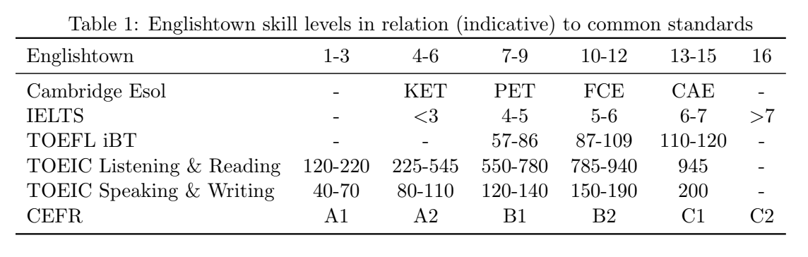

# Dataset

## CLEAR-Corpus

[Clear-Corpus](https://github.com/scrosseye/CLEAR-Corpus/tree/main)

### Description

It provides unique readability scores for 4724 text excerpts leveled for 3rd-12th grade readers along with information about the excerpt’s year of publishing, genre, and other meta-data.
The CLEAR corpus is meant to provide researchers interested in discourse processing and reading with a resource from which to develop and test readability metrics and to model text readability.
The CLEAR corpus includes a number of improvements in comparison to previous readability corpora including size (N = ~5,000 reading excerpts), breadth of the excerpts available, which cover over 250 years of writing in two different genres, and unique readability criterion provided for each text based on teachers’ ratings of text difficulty for student readers.
This dataset contain 4724 rows and 28 columns. 10 columns are related to the readability scores. Those columns are: BT_easiness, s.e., Flesch-Reading-Ease, Flesch-Kincaid-Grade-Level, Automated Readability Index, SMOG Readability, New Dale-Chall Readability Formula, CAREC, CAREC_M, CML2RI.

### File Structure

| Column Name | Description |
| ----------- | ----------- |
| Label | Description |
| ID | Unique excerpt identifier |
| Author | Author of excerpt |
| Title | Title of excerpt |
| Anthology | Anthology from which excerpt was taken (if applicable) |
| URL | URL link to excerpt (if applicable) |
| Pub Year | Year of publication for excerpt |
| Categ | Category of excerpt (informative or literary) |
| Sub Cat | Sub-category for informative excerpts (if available) |
| Lexile Band | Lexile reading score band |
| Location | Location in excerpt from where except was taken |
| License | License for excerpt (if applicable) |
| MPAA Max | Motion Picture Association of America rating (from G to R) |
| MPAA #Max | Max MPAA rating given |
| MPAA# Avg | Average MPAA rating between two raters |
| Excerpt | The excerpt |
| Google WC | Word count for excerpt reported by Google |
| Sentence Count | Number of sentences in excerpt |
| Paragraphs | Number of paragraphs in excerpt |
| BT_easiness | Bradley Terry text easiness/readability score (i.e., CLEAR score) |
| s.e. | Standared error for BT_easiness score |
| Flesch-Reading-Ease | Flesch-Reading-Ease score |
| Flesch-Kincaid-Grade-Level | Flesch-Kincaid-Grade-Level score |
| Automated Readability Index | Automated Readability Index scor |
| SMOG Readability | SMOG Readability score |
| New Dale-Chall Readability Formula | New Dale-Chall Readability Formula score |
| CAREC | Crowdsourced algorithm of reading comprehension (CAREC) score |
| CAREC_M | Crowdsourced algorithm of reading comprehension (CAREC_M) score controlled for text length |
| CML2RI | Coh-Metric L2 Readability Index (CML2RI) |

## Corpus of Sentences rated with Human Complexity Judgments

[Corpus of Sentences rated with Human Complexity Judgments](http://www.italianlp.it/resources/corpus-of-sentences-rated-with-human-complexity-judgments/)

### Description

This dataset 1,200 English sentences rated by humans with a judgment of complexity. Judgments were collected through a crowdsourcing task in which 20 native speakers of each language were asked to judge how difficult they perceived a given sentence on a complexity scale from 1 (i.e. “very easy”) to 7 (i.e. “very difficult”).
The datasets of sentences used for the task were taken from the automatically converted Wall Street Journal section of the Penn Treebank for the English experiment.
This dataset contain 1200 rows and 21 columns. 20 columns are related to the judgement scores by the human.

### File Structure

The data is present in csv format. The columns are as follows:

- ID: unique identifier of the sentence
- Sentence: the sentence
- 20 columns: the judgments of the 20 annotators

### Citation

```[bibtex]
Brunato D., De Mattei L., Dell’Orletta F., Iavarone B., Venturi G. (2018) “Is this Sentence Difficult? Do you Agree?“. In Proceedings of the 2018 Conference on Empirical Methods in Natural Language Processing (EMNLP 2018), 31–4 November, Bruxelles.
```

## REALEC

[REALEC](https://realec.org)

### Description

REALEC, learner corpus released in the open access, have 6,054 essays written in English by HSE undergraduate students in their English university-level examination by the year 2020.
Lots of these essays has been given CEFR level based on proficiency. This [paper](https://dl.acm.org/doi/abs/10.1007/978-3-031-16270-1_7) provides methods used to collect and annotate the data.
Currently, we have taken EXAM 2016 folder of dataset which had 1334 essays out of which only 538 entries had CEFR scored with it. We have taken only those entries which had CEFR score with it. This can be extended to other dataset present in REALEC.

### File Structure

The data is generatd in csv format. The columns are as follows:

- sentence:  Text for the complexity
- ielts: Is it part of the Ielts exam
- CEFR_level: CEFR level of the text
- work_type: From where text has been taken, for example exam, essay, etc.
- year: Year of the exam

## MMLL - EFCAMDAT

[MMLL - EFCAMDAT](https://ef-lab.mmll.cam.ac.uk/)

### Description

Efcamdat is an open access corpus consisting of writings of learners of English worldwide submitted to Englishtown, the online school of EF Education First1.
It is a collaborative project between the Dept. of Theoretical and Applied Linguistics, University of Cambridge and EF Education First, developed with the support of the Isaac Newton Trust, Trinity College. The corpus was first released in July 2013. 
Skill level of writing evaluated to common standards:



Main prompt dataset contain 406062 rows.
Alternative prompt dataset contain 317220 rows.

### File Structure

The data is presented in excel format. The columns are as follows:

- writing_id: contains a unique identifier for each text.
- cefr: It contains the text’s CEFR level as an ordered factor, derived from the proficiency level based on the EFCAMDAT’s guidelines. It has 5 level — A1, A2, B1, B2 and C1.
- cefr_numeric: It contains the text’s CEFR level, converted into a numeric variable.
- level: It contains the proficiency level of the task, based on the levels used in EF’s school(1-15)
- grade: It contains the grade that the text received from the teacher.
- wordcount: It contains the number of words in the text, measured using a custom function available in the scripts.
- mtld: It contains the measure of textual lexical diversity for that text, as calculated using the lexical_diversity library in Python on the corrected version of the text. **read the caveats about using MTLD to calculate the lexical diversity of texts that are as short as those in the sample.**
- text: It contains the text for that task.
- text_corrected: It contains a version of the text with spelling that was corrected using the
Speller function in Python’s autocorrect library.

### Citation

```[bibtex]
@article{shatz2020refining,
  author = {Shatz, Itamar},
  title = {Refining and modifying the EFCAMDAT: Lessons from creating a new corpus from an existing large-scale English learner language database},
  journal = {International Journal of Learner Corpus Research},
  volume = {6},
  number = {2},
  pages = {220--236},
  year = {2020},
  doi = {10.1075/ijlcr.20009.sha},
  url = {https://doi.org/10.1075/ijlcr.20009.sha}
}

@inproceedings{EFCAMDAT,
  title = {EFCAMDAT},
  author = {Y. Huang, A. Murakami,T. Alexopoulou, A.Korhonen},
  booktitle = {Proceedings of the 31st Second Language Research Forum (SLRF)},
  journal = {Dependency parsing of learner English, International Journal of Corpus Linguistics}
  address = {Carnegie Mellon},
  publisher = {Cascadilla Press},
  pages = {1-15},
  year = {2018},
}

@article{geertzen2013automatic,
  author    = {J. Geertzen and T. Alexopoulou and A. Korhonen},
  title     = {Automatic linguistic annotation of large scale L2 databases: The EF-Cambridge Open Language Database},
  year      = {2013}
}
```

## NEWSELA - Article Corpus

The Newsela dataset is a rich collection of news articles covering a wide range of topics from reputable sources. It provide multiple versions of each article, including simplified versions tailored to different reading levels.

This dataset contain 10786 entries and 7 columns.

### File Structure

The data is presented in dataframe format. The columns are as follows:

- language: specifying article language -- en or es.
- slug: unique name for each article.
- title: It contains the text’s CEFR level, converted into a numeric variable.
- grade_level: value between 2.0 (lowest) and 12.0 (highest)
- version: For each slug, there is 1 original article and 4 or 5 simplified versions. Version 0 is the original, and 5 or 6 is the simplest.
- filename: File name in the articles folder.
- content: It contains the text for that article.

@article{xu-etal-2015-problems,
    title = "Problems in Current Text Simplification Research: New Data Can Help",
    author = "Xu, Wei  and
      Callison-Burch, Chris  and
      Napoles, Courtney",
    journal = "Transactions of the Association for Computational Linguistics",
    volume = "3",
    year = "2015",
    address = "Cambridge, MA",
    publisher = "MIT Press",
    url = "https://aclanthology.org/Q15-1021",
    doi = "10.1162/tacl_a_00139",
    pages = "283--297",
}

## Asset Dataset

ASSET is a dataset for evaluating Sentence Simplification systems with multiple rewriting transformations. The corpus is composed of 2000 validation and 359 test original sentences.

### File Structure

The data is presented in dataframe format. The columns are as follows:

- original: Original sentence
- simplified: Simplified sentence in the same language by 10 authors.

@inproceedings{alva-manchego_asset_2020,
  address = {Online},
  title = {{ASSET}: {A} {Dataset} for {Tuning} and {Evaluation} of {Sentence} {Simplification} {Models} with {Multiple} {Rewriting} {Transformations}},
  shorttitle = {{ASSET}},
  url = {https://aclanthology.org/2020.acl-main.424},
  doi = {10.18653/v1/2020.acl-main.424},
  urldate = {2023-10-18},
  booktitle = {Proceedings of the 58th {Annual} {Meeting} of the {Association} for {Computational} {Linguistics}},
  publisher = {Association for Computational Linguistics},
  author = {Alva-Manchego, Fernando and Martin, Louis and Bordes, Antoine and Scarton, Carolina and Sagot, Benoît and Specia, Lucia},
  month = jul,
  year = {2020},
  pages = {4668--4679},
}

